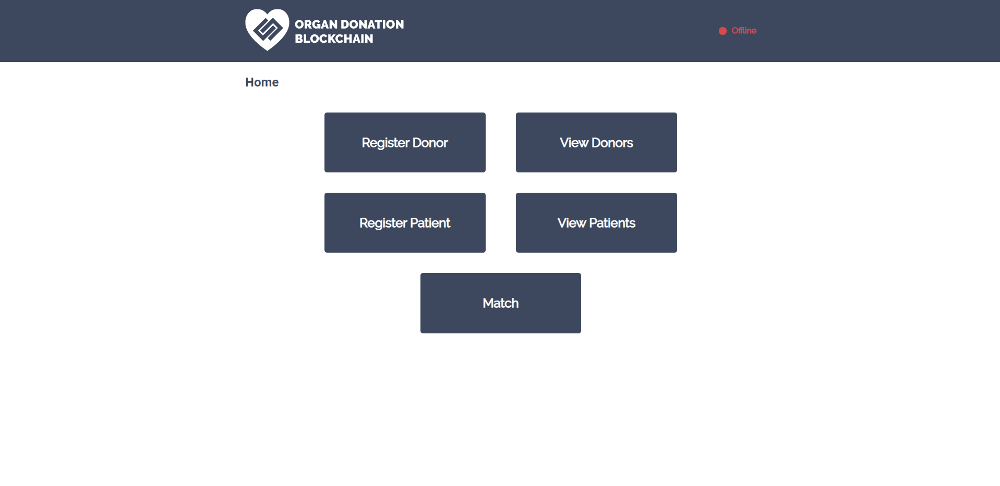

# 8Lives.
[](https://www.youtube.com/watch?v=mFzQlzk_bKU)

8Lives is a Blockchain Organ Donation prototype created as a proof-of-concept for a decentralized solution. The application is built on Ethereum, more specifically on Remix where the smart contract is compiled and deployed. XDCpay serves as a wallet for managing the fake XDC coins. A front-end interface application is built in JavaScript and interacts with the back-end via Web3.js. 

# 8 different organs can be donated from human body.

## Getting Started

The following instructions will create a copy of the project up and running on your local machine for development and testing purposes.

### Prerequisites

- XDCPay Chrome extension needs to be installed. (https://chrome.google.com/webstore/detail/xdcpay/bocpokimicclpaiekenaeelehdjllofo)

### Installing

Clone the 8Lives. repository onto local machine.
```
git clone https://github.com/Bogeshwararao/8Lives.git
```
Open the index.html file and ensure it displays the following:


## Setting up the Environment
- Ensure that Ganache is running and linked to MetaMask.
- Go to https://remix.ethereum.org and import the OrganDonation.sol file.

### Compile and Deploy Smart Contract
- Compile Solidity file.
- Select Injected Web3 under Environment.
- Ensure account address matches the one in Ganache.
- Deploy and confirm.
- Ensure that the smart contract address matches the one in the web3.js file (line 277).
- Otherwise, update the address.

```
const contractAddress = 'insert smart contract address';
```

### Testing the Application
The website should now show that is it online.

